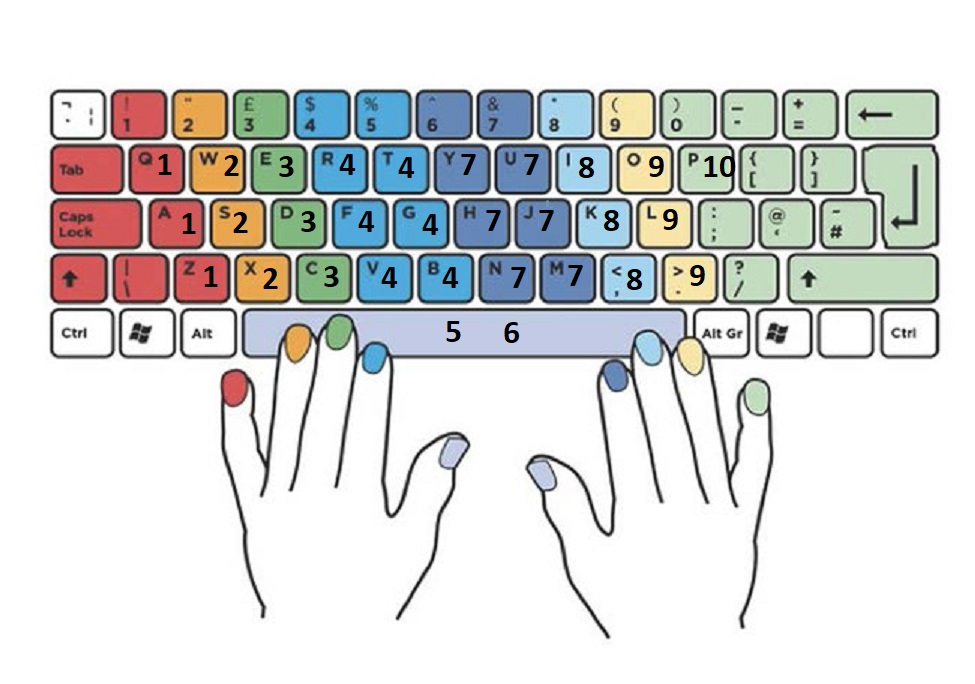

# NoKeyboardAlgorithm

## Table of Contents

- [Project Description](#project-description)
- [Features](#features)
- [Installation](#installation)
- [Usage](#usage)
- [Contributing](#contributing)
- [License](#license)
- [Acknowledgments](#acknowledgments)
- [Contact](#contact)

## Project Description

The concept of this project is to create an algorithm for a keyboard with only 10 buttons. Each button, as seen below, represents a few letters on the keyboard. This project consists of a dictionary and a trie of words created by the number inputs. The digit 1 represents "a". This word would be added to a list, then it would be searched for in the trie structured word bank. Since "a" is found then it would be returned.

By entering 73999, the ideal output would be "hello". Although it would produce several variations of this. Here is an example of the letter combination size.

* Level 1: 6 options (Y, U, H, J, N, H)

* Level 2: 3 options for each of the 6 options from Level 1 = 6 * 3 = 18 options (E, D, C)
   
* Level 3: 3 options for each of the 18 options from Level 2 = 18 * 2 = 36 options (O, L)
   
* Level 4: 3 options for each of the 54 options from Level 3 = 54 * 2 = 72 options (O, L)
   
* Level 5: 3 options for each of the 162 options from Level 4 = 162 * 2 = 144 options (O, L)
   
1 of the 144 will be hello with the correct letters. Once a combination is found in the trie, it will be returned.

## Features
- Trie Data Structure for searching dictionary. (25,000 words)
- Writing over CSV file.
- Word to number and number to word algorithm.
  
## Installation

## Usage

## Contributing

## License
None.

## Acknowledgments

## Contact
tatesmouser@gmail.com
